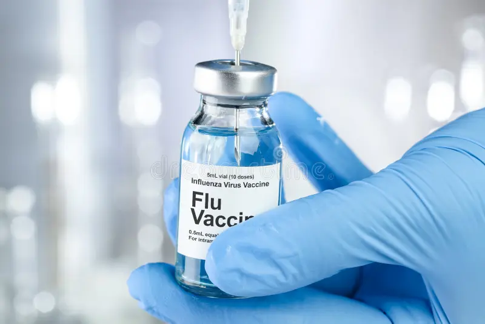
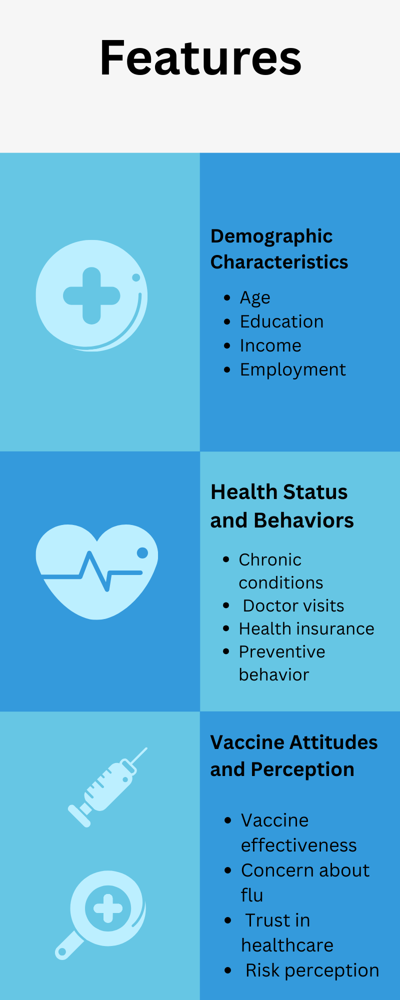
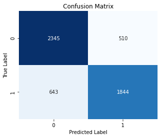
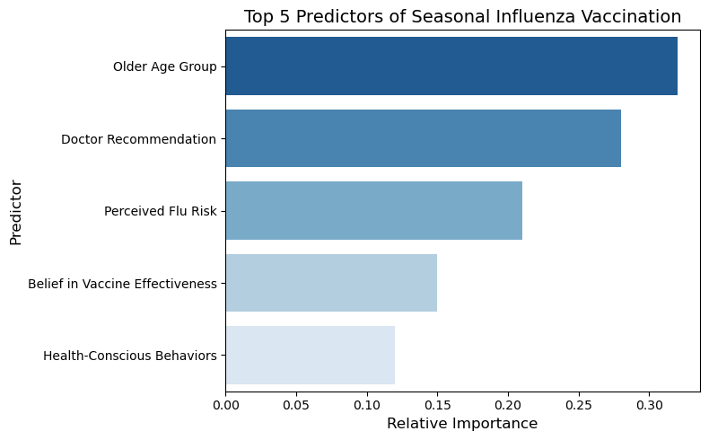

# Seasonal-Flu-Vaccine Prediction

#### Introduction
Seasonal influenza, commonly known as the flu, is a contagious respiratory illness caused by influenza viruses that infect the nose, throat, and sometimes the lungs. An annual seasonal flu vaccine can help mitigate the effects of the flu by reducing its severity. In this project, we will predict the demand for seasonal flu vaccines based on historical data.
#### Problem Statement

Seasonal influenza remains a significant public health concern, yet vaccination uptake varies across different population groups. Factors such as misinformation, limited healthcare access, and differing perceptions of vaccine safety contribute to low vaccination rates. Identifying the groups less likely to receive the flu vaccine is essential for designing targeted public health interventions and improving overall vaccination coverage.
#### Main Objective

The objective of this project is to build an interpretable machine learning model that predicts whether an individual will receive the seasonal flu vaccine, using survey data to support targeted public health interventions.
#### Data Description
The dataset used for this project comprises 36 columns, providing extensive information about individuals' characteristics and opinions related to flu vaccination.

- Identifiers:

     - *respondent_id*: Unique identifier
- Target Variable:

    - *Seasonal_vaccine*: Whether respondent received seasonal flu vaccine (Binary: 0=No; 1=Yes)
    
Feature Characteristics and Opinions Visual:

#### Data Preparation
The raw dataset underwent a series of essential data preparation steps to ensure its quality and suitability for machine learning. This included:

1. Categorical Encoding: Categorical variables were transformed using one-hot encoding.
2. Multicollinearity Handling: A multicollinearity check was performed, and highly correlated feature pairs (correlation > 0.7 or < -0.7) were identified and one variable from each pair was removed.
3. Data Splitting: The dataset was split into features (excluding h1n1_vaccine) and the seasonal_vaccine target using a stratified train-validation split to maintain class proportions.
4. Missing Value Imputation: Missing values were handled using imputation: median for numerical variables and the most frequent value for binary categorical variables.
5. Feature Scaling: Numerical (ordinal) features were scaled using StandardScaler().

#### Modeling
The goal was to predict seasonal_vaccine uptake. The dataset was split into training and test subsets:

- Training Data: Used to fit the predictive models.
- Test Data: Used to evaluate performance on unseen data.
An iterative modeling approach was applied. After splitting the dataset, Recursive Feature Elimination (RFE) was used to select the most relevant predictors.

Three classification models were developed and compared:

- Logistic Regression – used as the baseline model due to its interpretability.

- Decision Tree – used to capture nonlinear relationships between variables.

- Random Forest – an ensemble model designed to improve prediction accuracy and reduce overfitting.

Hyperparameter tuning was performed to optimize model performance.

#### Model Evaluation
Model performance was primarily evaluated using the AUC-ROC Score.

Best Model: Logistic Regression
AUC Score: 0.86
Confusion Matrix (Logistic Regression):

- True Positives (TP): 2345 - Predicted positive, actual positive.
- True Negatives (TN): 1843 - Predicted negative, actual negative.
- alse Positives (FP): 510 - Predicted positive, actual negative.
- False Negatives (FN): 644 - Predicted negative, actual positive.

#### Key Features - For predicting seasonal_vaccine uptake
This reveals several variables that strongly influence vaccination decisions.

#### Conclusion
The Logistic Regression model was selected as the best model with an AUC of 0.8557, offering the strongest balance of predictive performance and interpretability.
Across all three models, four features consistently drove vaccination uptake: age (65+), doctor's recommendation, perceived flu risk, and belief in vaccine effectiveness and health conscious behaviors, confirming that vaccination decisions are shaped more by attitudes and provider influence than demographics alone.

#### Recommendations
Based on top features identified:

- Target Younger Adults: Focus vaccination campaigns on younger populations where uptake tends to be lower.

- Leverage Doctor Recommendations: Encourage healthcare providers to actively recommend flu vaccination.

- Increase Risk Awareness: Educate the public about the potential risks and complications of influenza.

- Promote Vaccine Effectiveness: Share evidence-based information about vaccine safety and effectiveness.

- Address Vaccine Concerns: Combat misinformation and clarify misconceptions about vaccine side effects.

- Sustain Senior Outreach: Continue strong vaccination programs for individuals aged 65 and above while expanding efforts to other groups.

#### Next Steps
To enhance the impact:

- Continuous Monitoring: Track vaccination rates and update models with new data.

- Pilot Targeted Outreach Programs: Implement interventions guided by model predictions.

- Data Enhancement: Collect more detailed behavioral and healthcare access data to improve predictive accuracy.

#### Stakeholder Collaboration
Effective implementation of these insights requires collaboration between public health agencies, healthcare providers, policymakers, and data scientists. By integrating predictive analytics into public health strategies, organizations can design more targeted and effective vaccination campaigns.

## Reproducibility

To run this project:

pip install -r requirements.txt

Then launch Jupyter Notebook:

jupyter notebook

#### Project Structure

Seasonal-Flu-Vaccine/

│── Data/  
│   ├── training_set_features.csv → training features dataset  
│   ├── training_set_labels.csv → target labels  
│   ├── test_set_features.csv → test dataset  

│── Images/  
│   ├── confusion_matrix.png → model evaluation plot  
│   ├── flu_vaccine.jpg → project illustration  
│   ├── predictors.png → feature importance visualization  

│── notebooks/  
│   ├── EDA&Modelling.ipynb → main analysis and modeling notebook  

│── models/  
│   ├── seasonal_flu_vaccine_predictor.joblib → trained model  

│── reports/  
│   ├── notebook.pdf → exported notebook  
│   ├── presentation.pdf → project presentation  

│── .gitignore  
│── README.md  
│── requirements.txt  

